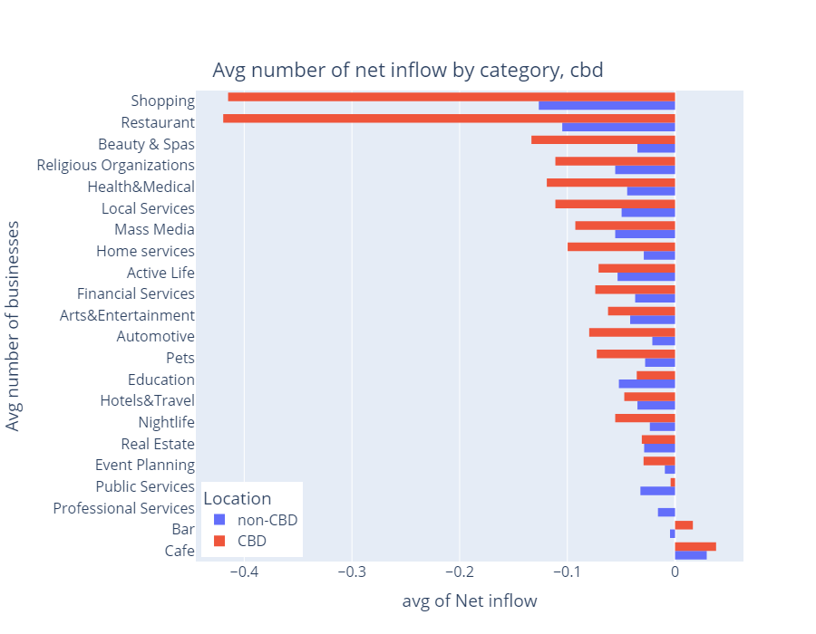
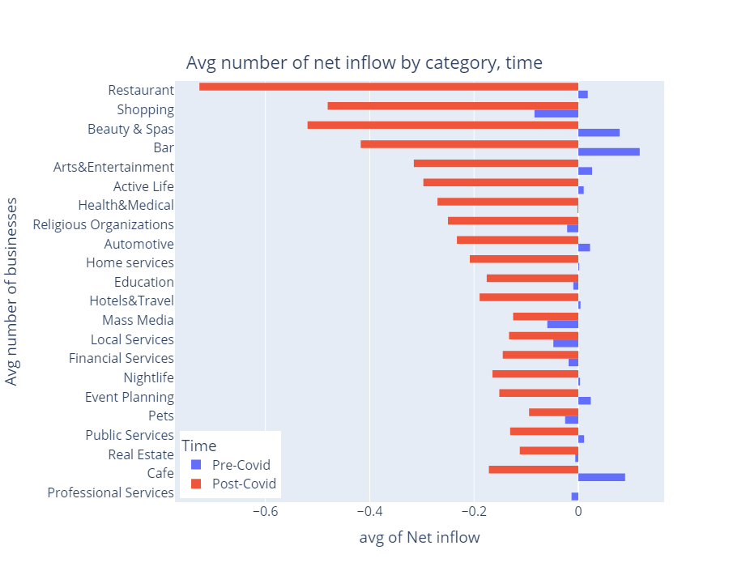
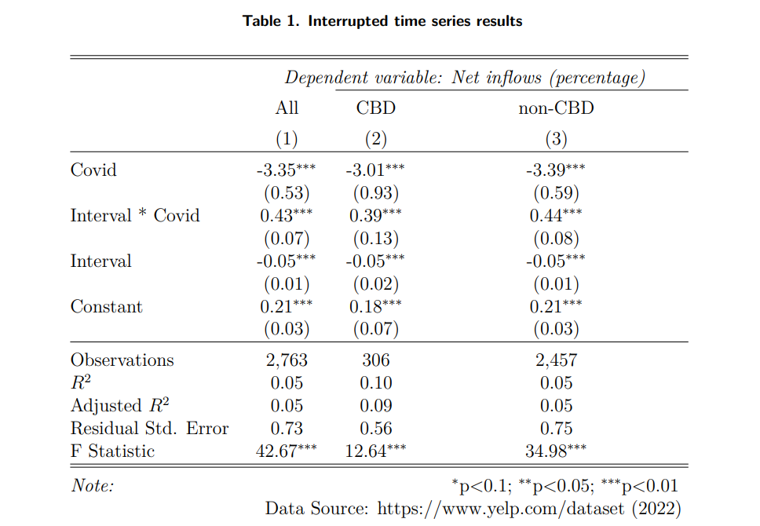
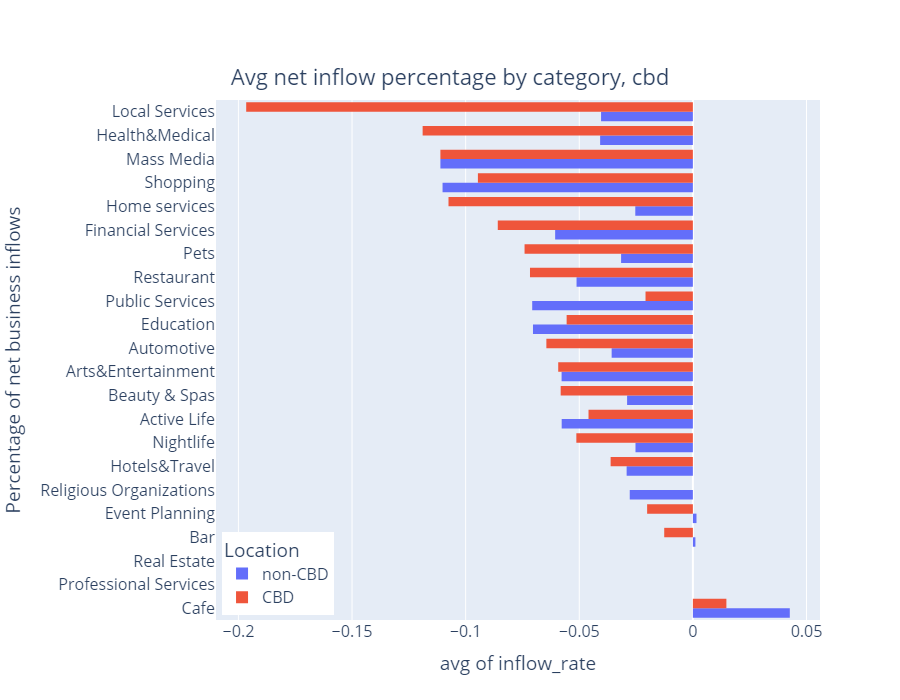
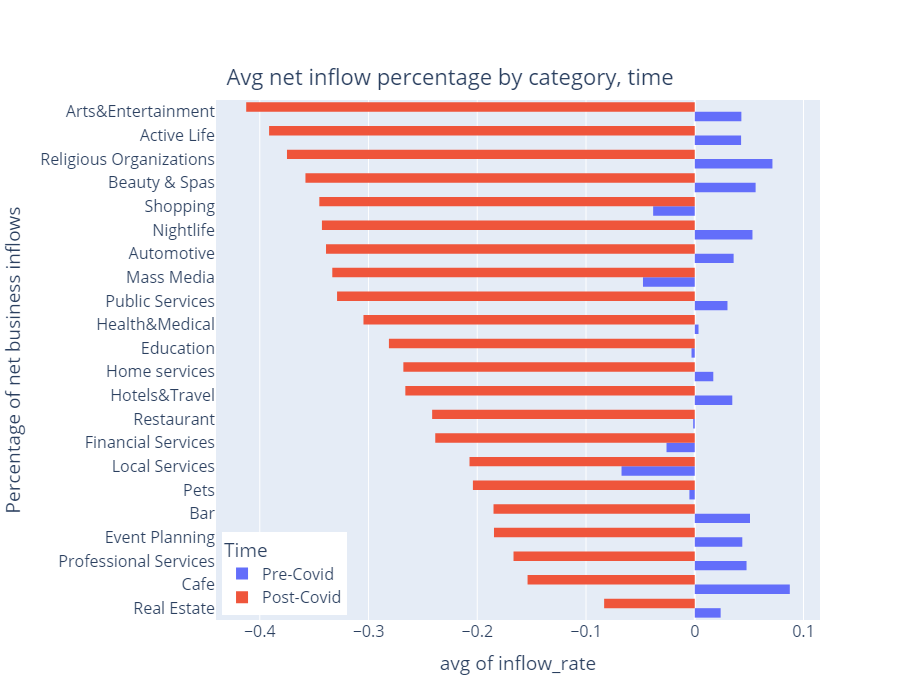
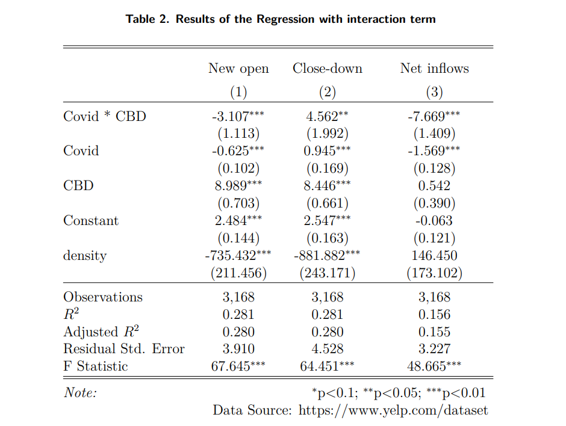
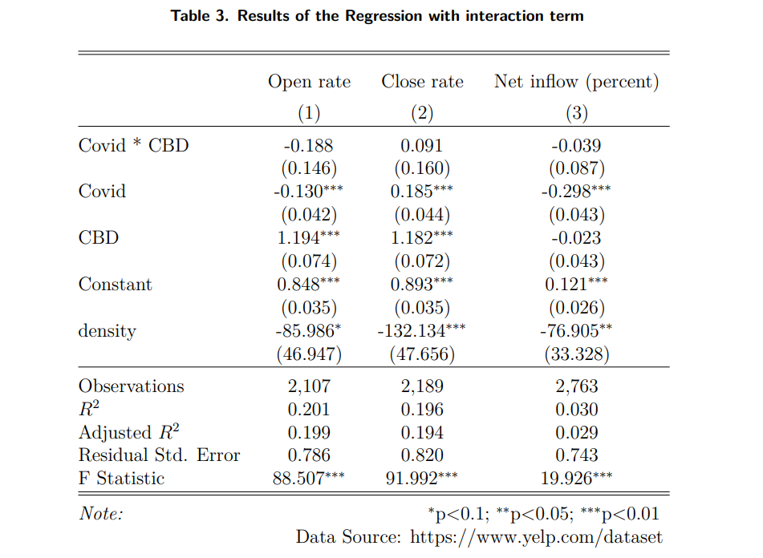
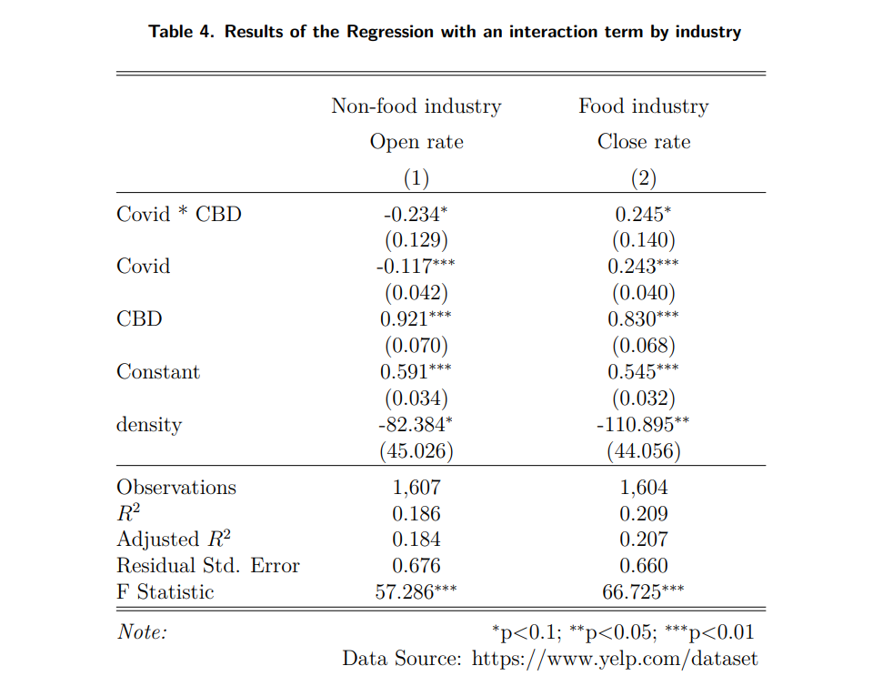

# Perspective in Computational Research MACS 30200
University of Chicago

Peihan Gao    

MACSS 23'

## **Research Questions**                    
1. How does the Covid affect the businss inflows?                  
2. Does the "donut effect exist?              

## **Abstract**                    
Leveraging data from the online sharing platform Yelp.com, this paper provides new insight into the changing nature and geography of businesses within cities in the wake of the Covid pandemic. This paper investigates the impact of the recent pandemic of the Covid-19 on business change, and tests the effect of the Covid-19 on the migration patterns of businesses flowing from city center to the rings within large cities in the U.S, which is called the "donut effect". Consistent with other researches, following an initial decline, the overall level of tracts-level business net inflow not only rebounds but increases across all census tracts. Specifically, Covid does lead to net outflows of all the businesses, especially for restaurants, shopping centers, beauty & spas and bars in CBD areas which had the largest business stock base before the Covid. So the Covid-19 has more impact on the businesses in central business district (CBD) areas than non-CBDs in terms of net inflows. However, there is no significant gap between CBDs and non-CBDs for business net inflows after excluding the influence of the business stock. Art & entertainment, active life (parks, etc.), religious organizations and beauty & spas which require in-person participation have declined to the most extend. Businesses doesn't present an out-flowing trend from CDBs to other areas. The result is in conflict with the existing literature documenting residents and business outflows from CBDs as the "donut effect".              

## **Data and Code source**  
- [Yelp](https://www.yelp.com/dataset)        
- [Census Bureau](https://www.census.gov/data.html)         
- [Census Bureau API - python usage](https://towardsdatascience.com/    accessing-census-data-with-python-3e2f2b56e20d)            
- [Philadelphia City data](https://www.opendataphilly.org/dataset/philadelphia-neighborhoods/resource/6c61f240-aafe-478e-b993-b75fd09a93d6)        

             
## **Methods**             
- Descriptive Analysis              
- Interrupted time series       
- Interactive linear regression      

## **Results Visulization**         
> Question 1      
          
   
         
            
            
  
   
               
> Question 2          
             
            
           
  
          
           
          
        

        
## **Conlusion**

With the onset of the coronavirus since the start of 2020, social distancing restrictions and demand shifts shuttered many customer services commercials, businesses and entrepreneurs in the first year of widespread shelter-in-place restrictions. The practices of health precautions and airline regulations also directly contained the opening of new businesses and intensified a large number of business closures. 

The present paper fills the gap investigating the effect at a census tract level within one city in that the existing series of papers conducting the research of the impacts of Covid on business patterns in the era of pandemic at a state level around the U.S. Using the data of online platform yelp, the paper answers more granular questions including What is the exact number of the business net outflows caused by Covid and how this health emergency affected different categories of businesses.

On top of the potential closures caused by either financial suffering or the mandate distancing policies undertaken by the business owners, this unprecedented global health emergency also reshaped and reallocated businesses within and across big cities in the U.S., changed the people's livelihoods, establishments' geographies and companies risk-aversion behaviors as well, which are anticipated placing the urban pattern in a dynamic change. The geographical change of businesses is first documented by Donthu and Gustafsson (2020) and Liu and Su (2021), they examine 12 largest US cities on a zip-code level, and find that within these big cities, people moved from central business districts (CBDs) to suburban places, along with the reallocation of the real estate demands. They called it “donut effect”. Following their steps, this paper investigated the existence of the effect, to check whether the heterogeneity of businesses outflows presents between Central Business Districts and other areas. As a result, there is no significant heterogeneity between the impact on business net inflows percentage, which is conflict with the findings of their research. 

To avoid the shortcomings of online platform data, this paper alternates with using open data source from city data of Philadelphia and still obtains the similar results. Also, we adjust the definition of census tracts in CBDs from being 2 kilometers around the centroid of the CBDs to 5 kilometers around the CBD, which also didn't change the results. Last, in order to exclude the influence of tract-level characteristics and year-level effects, we conducted two alternative regressions controlling fixed time effects and fixed entity effects, which also showed same directions and significance of the effect.

In conclusion, this paper documents and quantifies the effect of Covid-19 on the business net inflows and the migration patterns of businesses in Philadelphia. We find that Covid-19 did cause the net outflows of businesses across the city and the effect varies across different industries. However, it didn't cause the migrations of businesses from central business districts(CBDs) to other areas, though the flow already showed clues before the shock. 

## **Reference**
