# Perspective in Computational Research MACS 30200
University of Chicago

Peihan Gao    

MACSS 23'

RQ: What is the movement of businesses before and after covid?

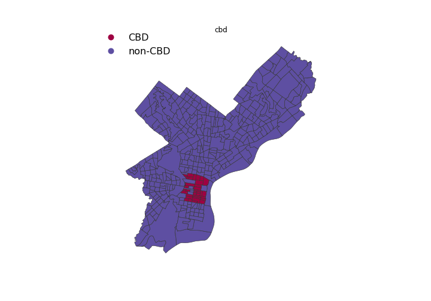        
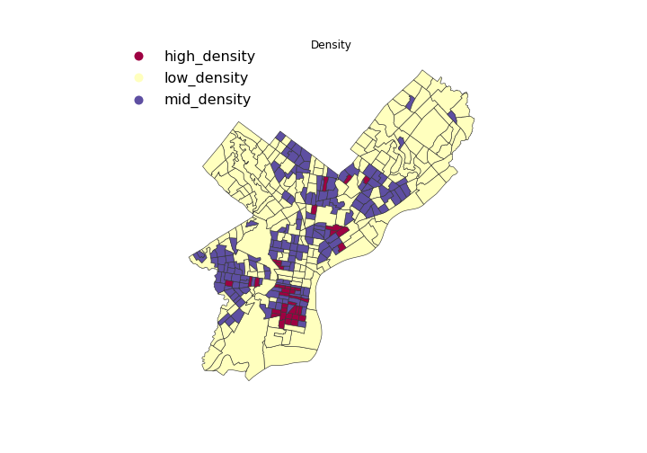       
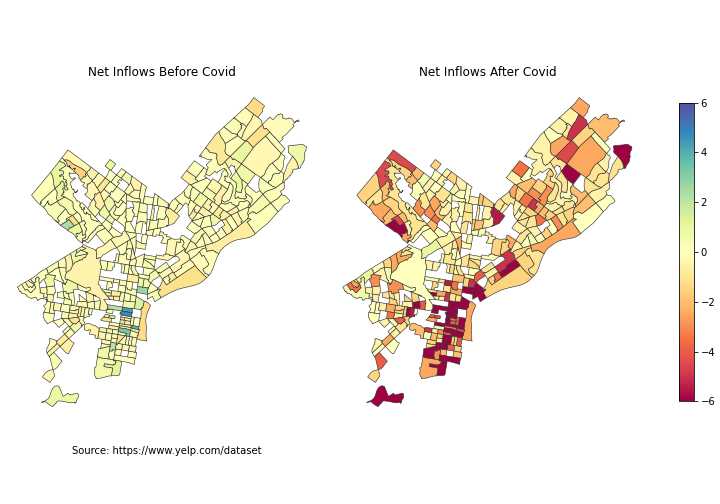        

!
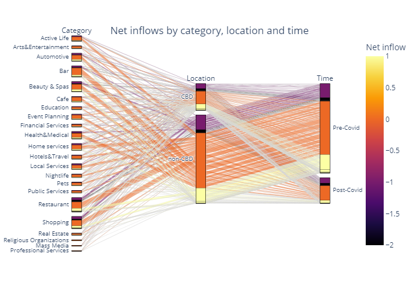
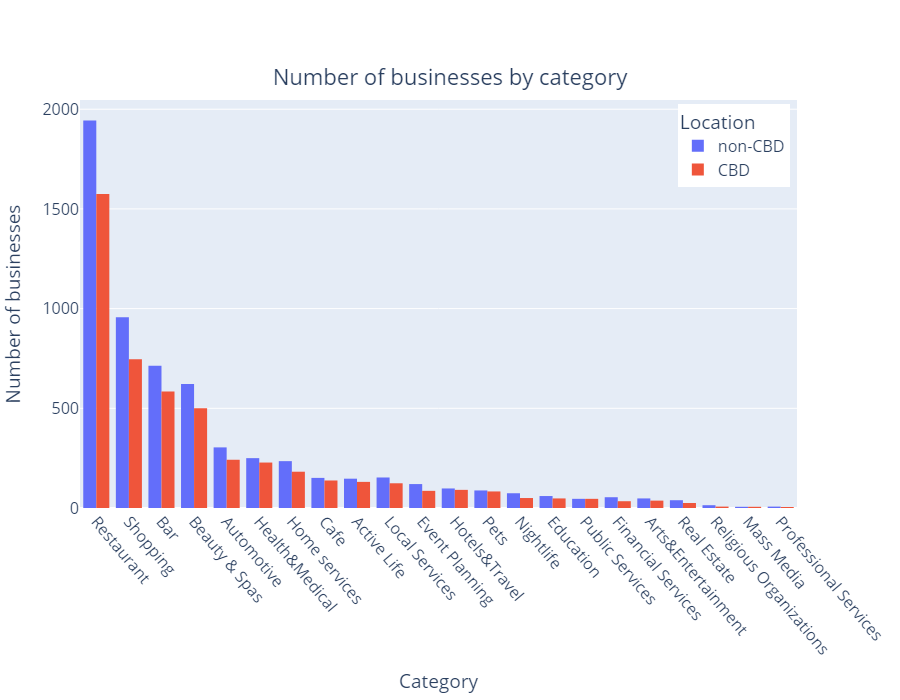

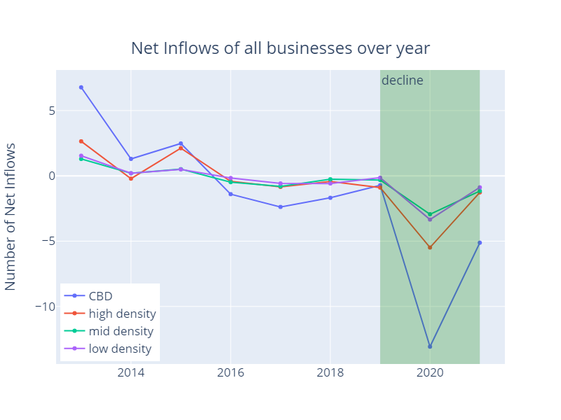
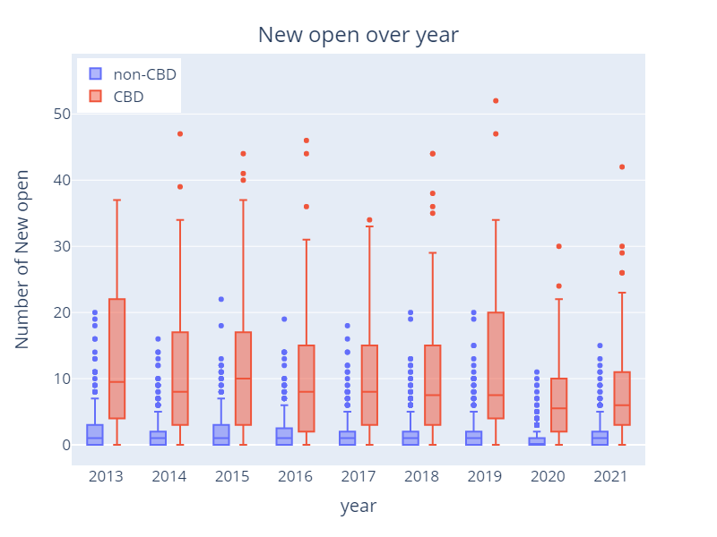
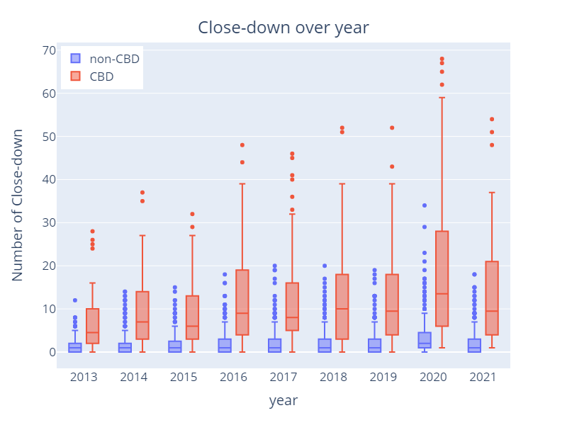
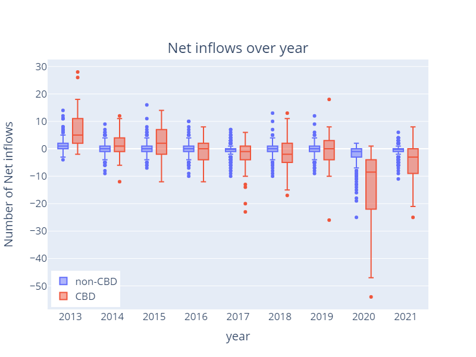

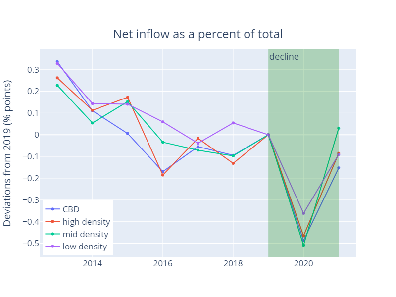
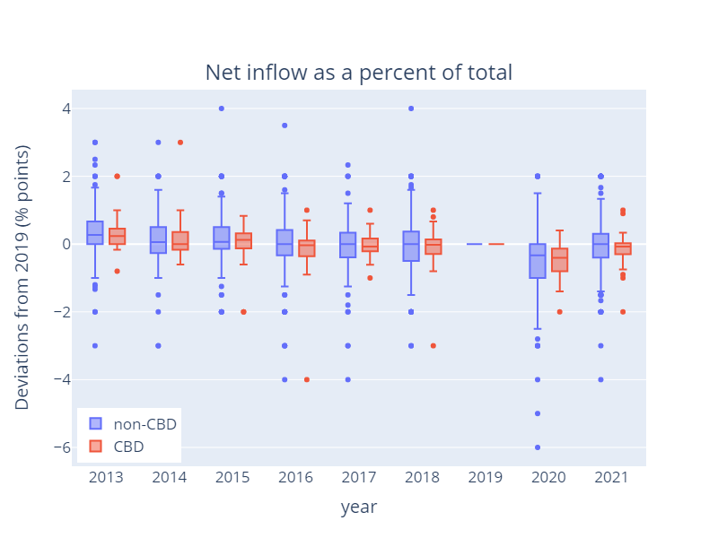

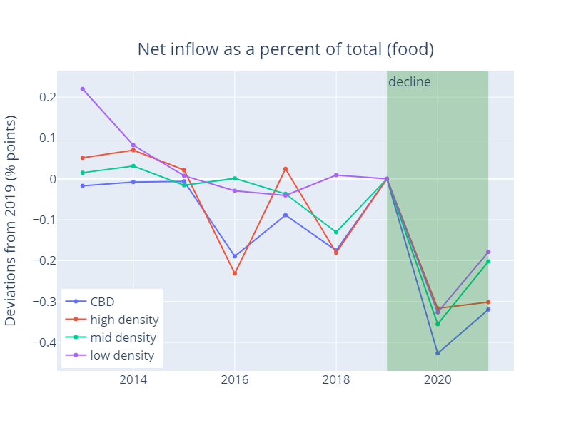

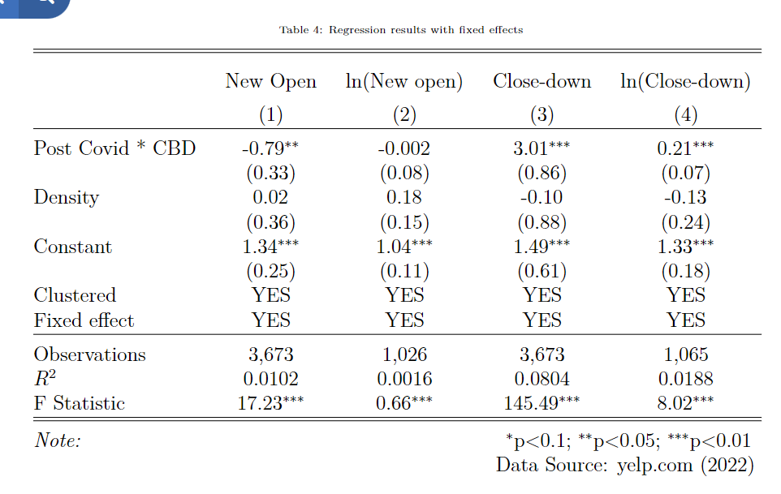
